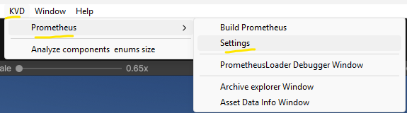

# Setup

[Table of contents](index.md)

This guide details the installation process for adding Prometheus to your Unity project. Prometheus relies on the `com.kvd.utils` package, so it is important to install it first.

## Installation

### As a local package (for customization) - Recommended

This method requires a few more steps than the immutable package approach, but it allows you to modify the code and fully tailor asset streaming to your needs.

1. Fork [com.kvd.utils](https://github.com/KamilVDono/com.kvd.utils).
   - For more information, see the [GitHub tutorial](https://docs.github.com/en/pull-requests/collaborating-with-pull-requests/working-with-forks/fork-a-repo).
2. Fork [com.kvd.prometheus](https://github.com/KamilVDono/com.kvd.prometheus).
3. Close the Unity editor.
4. Add `com.kvd.utils` as a submodule:
   - Run: `git submodule add <fork_url>.git Packages/com.kvd.utils` (replace `<fork_url>` with your fork URL). For the main package repository, use: `git submodule add https://github.com/KamilVDono/com.kvd.utils.git Packages/com.kvd.utils`
5. Add `com.kvd.prometheus` as a submodule:
   - Run: `git submodule add <fork_url>.git Packages/com.kvd.prometheus` (replace `<fork_url>` with your fork URL). For the main package repository, use: `git submodule add https://github.com/KamilVDono/com.kvd.prometheus.git Packages/com.kvd.prometheus`
6. Open Unity and enjoy!
7. (Optional) Contribute your changes.

### As an immutable package (use as-is)

This method is easier but limits you to using the package as it is, so you will not be able to modify the code.

1. Add the `com.kvd.utils` package (a utility library used by Prometheus) to your Unity project via the Package Manager:
   - See [Unity’s guide for Git packages](https://docs.unity3d.com/Manual/upm-ui-giturl.html).
   - URL: `https://github.com/KamilVDono/com.kvd.utils.git`
2. Add the Prometheus package the same way:
   - URL: `https://github.com/KamilVDono/com.kvd.prometheus.git`

## Settings

The settings window is available under the `KVD/Prometheus/Settings` menu item.

The settings window looks like this:

**Settings:**

* Use Build Data - Determines whether to use build data or fall back to the AssetDatabase.
  * `True` - Build data will be used.
  * `False` - AssetDatabase will be used.
* Build With Player - Prometheus automatically builds when you build your game.
* Compression Type - Which compression should be used for Content Files. See the [Unity documentation](https://docs.unity3d.com/ScriptReference/CompressionType.html).

## Build

### Manual

You can manually build Prometheus data (mapping and `Content Files`) via `KVD/Prometheus/Build Prometheus`.

### Automatic with player build

If you have enabled `Build With Player`, then Prometheus will automatically build when you build your game.