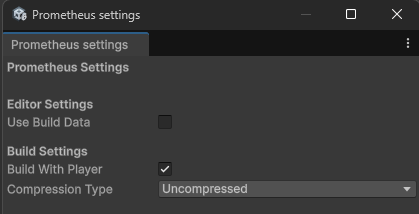

# Setup

[Table of contents](index.md)

This guide details the installation process for Prometheus into your Unity project. Prometheus relies on the `com.kvd.utils` package, so it's crucial to install it first.

## Installation

### As local package (for customization) - Recommended

This requires a bit more operations than immutable package way, but you can modify code in order to take advantage of full tailored assets streaming.

1. Make fork of [com.kvd.utils](https://github.com/KamilVDono/com.kvd.utils)
   - For more informations see [GitHub tutorial](https://docs.github.com/en/pull-requests/collaborating-with-pull-requests/working-with-forks/fork-a-repo)
2. Make fork of [com.kvd.prometheus](https://github.com/KamilVDono/com.kvd.prometheus)
3. Close Unity editor
4. Add `com.kvd.utils` as submodule
   - Run command: `git submodule add <fork_url>.git Packages/com.kvd.utils`, you need to replace `fork_url`. For main package repository it would look like: `git submodule add https://github.com/KamilVDono/com.kvd.utils.git Packages/com.kvd.utils`
5. Add `com.kvd.prometheus` as submodule
   - Run command: `git submodule add <fork_url>.git Packages/com.kvd.prometheus`, you need to replace `fork_url`. For main package repository it would look like: `git submodule add https://github.com/KamilVDono/com.kvd.prometheus.git Packages/com.kvd.prometheus`
6. Open Unity and enjoy
7. Contribute

### As immutable package (use as it)

That mode is easier but limit you to package as it is, so you won't be able to modify code.

1. Add the `com.kvd.utils` package (a utility library used by Prometheus) to your Unity project via the Package Manager:
   - See [Unity’s guide for Git packages](https://docs.unity3d.com/Manual/upm-ui-giturl.html).
   - URL: `https://github.com/KamilVDono/com.kvd.utils.git`
2. Add the Prometheus package the same way:
   - URL: `https://github.com/KamilVDono/com.kvd.prometheus.git`

## Settings

Settings window is under `KVD/Prometheus/Settings` menu item.

Settings window looks like:

**Settings:**

* Use Build Data - determines if it should fallback to AssetDatabase.
    * `True` - mean that build data will be used
    * `False` - mean that AssetDatabase will be used
* Build With Player - Prometheus automatically builds when you build your game.
* Compression Type - which compression should be used for Content Files. Check [Unity documentation](https://docs.unity3d.com/ScriptReference/CompressionType.html).

## Build

### Manual

You can build manually Prometheus data (mapping and `Content Files`) via `KVD/Prometheus/Build Prometheus`

### Automatic with player build

If you have enabled `Build With Player` then Prometheus automatically builds when you build your game.