# Tooling

[Table of contents](index.md)

All windows and actions are available through `MenuItems` in `KVD/Prometheus`. You can change Menu items placing by changing `KVDConsts.MenuItemPrefix` const.
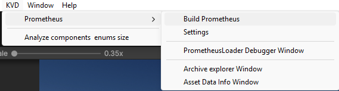

## Add assets to Prometheus

Assets have Prometheus header that let you inspect current state and change it. The header code is in `IsInPrometheusHeader`.
Possible state:

* Direct referenced - there is direct reference to that asset
  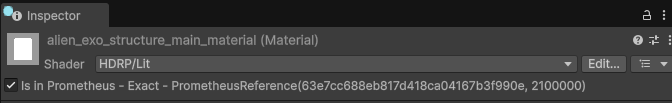
* Indirect reference - at least one of the assets hierarchy is direct reference
  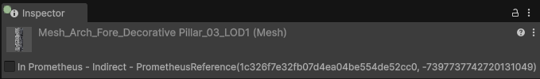
* Not referenced
  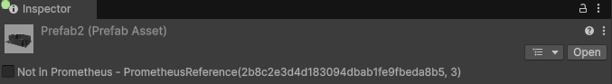

### Indirect reference

Some assets are simple and consist of just a single element asset hierarchy. But there are others, which have many assets inside hierarchy.
Such complex asset hierarchy is model, importing model creates model prefab, LOD meshes, default materials and maybe textures.

Let take simple example, you imported fbx with LOD0, LOD1, LOD2 and Collision mesh. You have rendering system that unloads unused LODs and system which streams colliders at fixed distance. So the setup would be:

* LOD0 - [0, 22)
* LOD1 - [20, 155)
* LOD2 - [150, 510)
* Collider - [0, 1200)

Feels like nice way to reduce used memory, but since all of these assets come from single assets hierarchy, all will be loaded whenever any loads. That mean loading collider mesh will load all meshes, this is not only true for Content Files, but for all Unity systems (as far as I know). Therefore you may want to author assets in such way that you will have all assets hierarchies with single elements.

## Settings

Available under `KVD/Prometheus/Settings`.

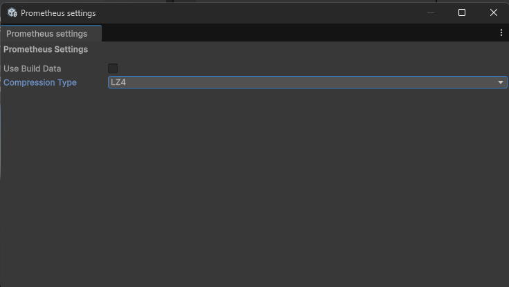

* Use Build Data - determines if it should fallback to AssetDatabase.
    * `True` - mean that build data will be used
    * `False` - mean that AssetDatabase will be used
* Build With Player - Prometheus automatically builds when you build your game.
* Compression Type - which compression should be used for Content Files. Check [Unity documentation](https://docs.unity3d.com/ScriptReference/CompressionType.html).

## Build

Available under `KVD/Prometheus/Build Prometheus`.
That performs just Prometheus build, that mean Prometheus metadata and Content Files, the player won't be built.

Build data can be found in `Library/Prometheus`, at player build it will be copied to the streaming assets.

## Debug

### Prometheus loader debugger

Available under `KVD/Prometheus/PrometheusLoader Debugger Window`.

`PrometheusLoaderDebugger` is runtime compatible, so you can draw it at runtime and debug in build.

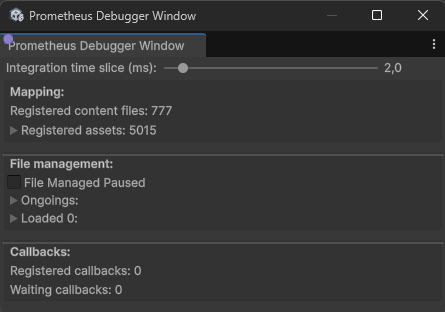

* **Integration time slice**: how much time can Content files take on main thread to integrate assets

#### Mapping

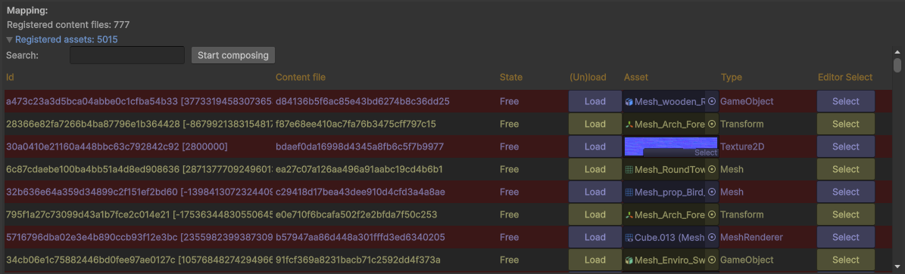

* **Registered content files**: Count of content files (not physical files count, but how many files was created and is needed by system to fully function)
* **Registered assets**: Asset which can be requested
    * **Id**: Asset identifier
    * **Content file**: Content file identifier
    * **State**: Current state of the asset
    * **(Un)load**: Button which allows you to force load or unload an asset
    * **Asset**: Editor source of the baked asset
    * **Editor Select**: Allow you select editor source asset

#### File management

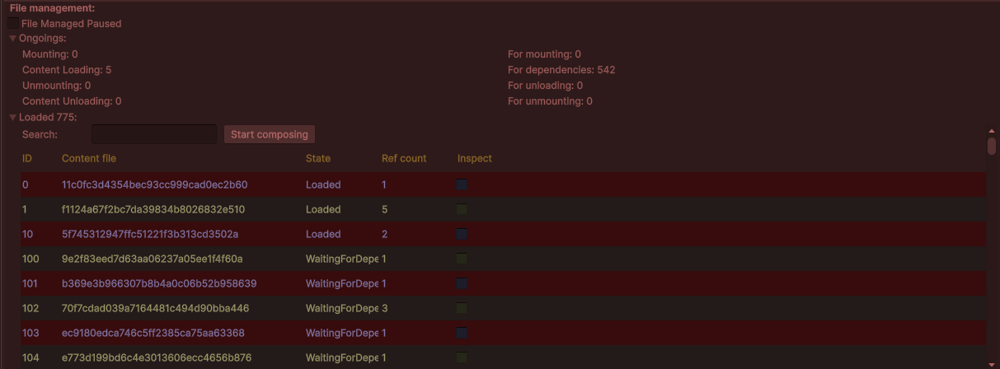

* **File Management Paused**: Can pause assets streaming
* **Ongoings**: Allows to check how many assets are in which state of streaming
    * **Mounting**: Count of `Archives` currently mounting
    * **Content Loading**: Count of `Content Files` currently loading
    * **Unmounting**: Count of `Archives` currently unmounting
    * **Content Unloading**: Count of `Content Files` currently unloading
    * **For mounting**: Count of `Archives` request to start mounting
    * **For dependencies**: Count of `Content Files` waiting for dependencies to be load first, only when all dependencies are loaded `Content File` load starts
    * **For unloading**: Count of `Content Files` waiting to start to unload
    * **For unmounting**: Count of `Archives` waiting to start unmounting
* **Loaded**: Count of requested assets (directly or as dependency), when expanded shows more informations about each request
    * **ID**: Loading index
    * **Content files**: `Content File` GUID (archive which contains it have the same GUID)
    * **State**: State of the `Content File`
    * **Ref count**: Reference counter for this `Content Files`
    * **Inspect**: Allows to inspect content of `Content File`

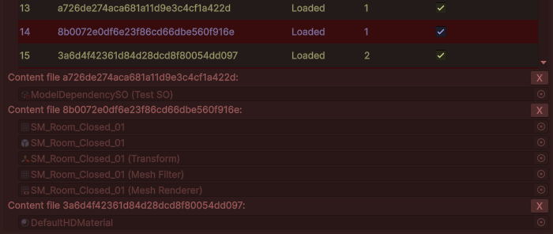

#### Callbacks

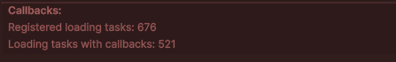

* **Registered loading tasks**: How many tasks are registered (loading or loaded but not released yet)
* **Loading tasks with callbacks**: How many tasks have waiting callback

## Archive explorer

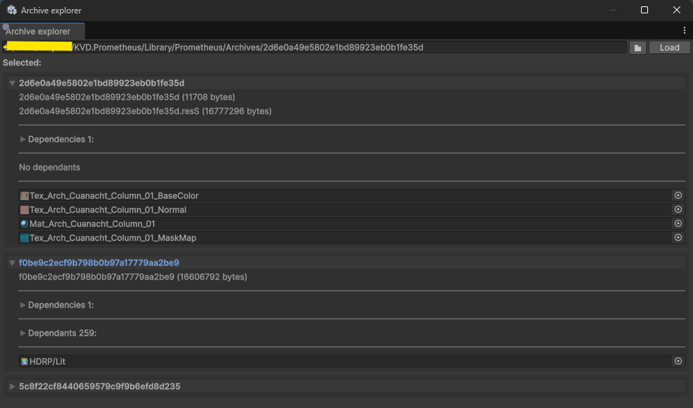

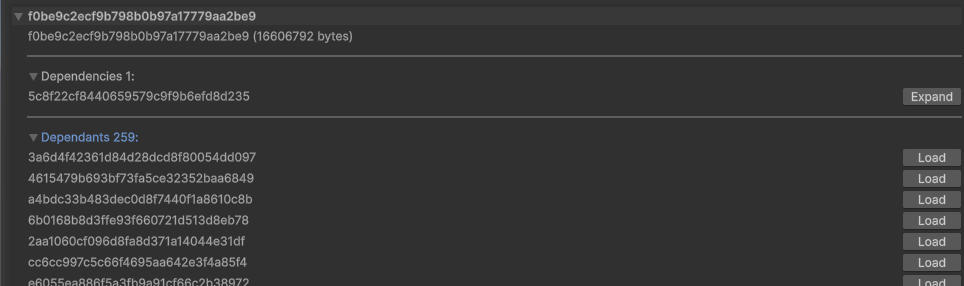

Allows you to check content of archive, dependencies and dependants.

You need to choose archive file and then click _Load_ button.
That will load archive (alongside with all dependencies).

After you Expand archive, there will be:

* Size of archive (archive can contain two files, I think it's the same as [AssetBundle](https://docs.unity3d.com/6000.1/Documentation/Manual/AssetBundlesIntro.html), one with serialized files and one with resources files) files
* Dependencies foldout - allows you to load/inspect dependencies
* Dependants foldout - allows you to check which other archive needs current one, from here you can load it
* Content of archive - allows you to inspect content of archive

## Asset data info

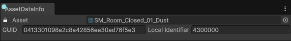

Allows you to find GUID and Local identifier of the asset (if not locked then it will change on selection).

